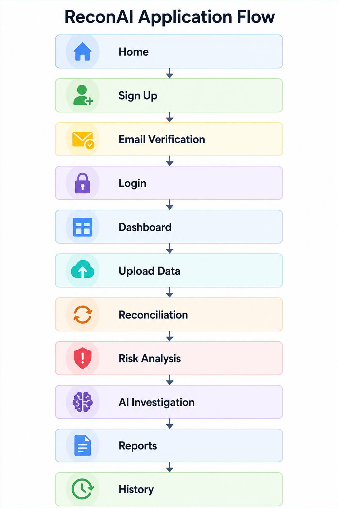
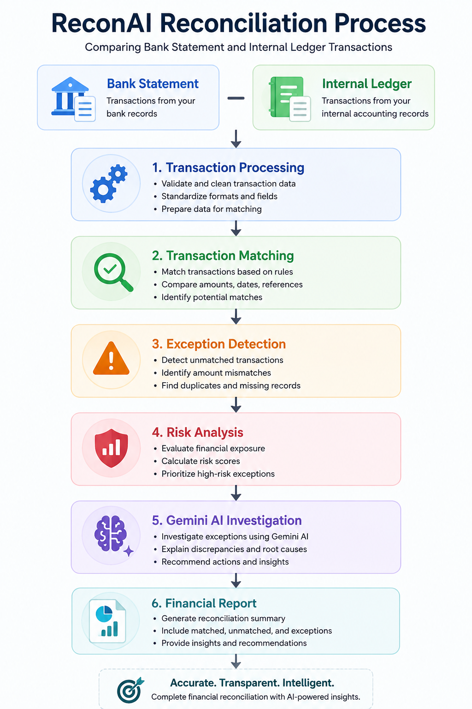

# 🔐 ReconAI — AI-Powered Financial Reconciliation

ReconAI is an AI-powered financial reconciliation platform designed to automate the comparison of bank statements and internal ledger transactions.

The application helps identify matched transactions, unmatched records, amount discrepancies, duplicates, financial risks, and other reconciliation exceptions.

ReconAI also uses **Google Gemini AI** to investigate financial exceptions, explain discrepancies, and provide intelligent recommendations.

---

## 📌 Project Overview

Financial reconciliation is an important process used to verify that transactions recorded by a company match the corresponding transactions in its bank statements or external financial records.

Traditional reconciliation can require significant manual effort when dealing with large transaction datasets.

**ReconAI automates this workflow by combining:**

- Automated transaction matching
- Exception detection
- Financial risk analysis
- AI-powered investigation
- Reconciliation history
- Financial reporting
- User authentication
- Email verification
- Dashboard-based financial intelligence

The goal of ReconAI is to provide a centralized platform where users can upload financial datasets, perform reconciliation, investigate exceptions, and generate meaningful financial insights.

### 🌐 Live Project

You can access the deployed ReconAI application here:

**🔗 Live Application:**  
[Open ReconAI](https://recon-6u0mjpppt-anjalineelam2005-5503s-projects.vercel.app/)

---

# ✨ Features

## 🔄 Automated Financial Reconciliation

Upload bank statement and internal ledger CSV files and automatically compare their transactions.

ReconAI can identify:

- Matched transactions
- Unmatched bank transactions
- Unmatched ledger transactions
- Amount mismatches
- Missing transactions
- Duplicate transactions
- Transaction discrepancies

---

## ⚠️ Exception Detection

ReconAI identifies transactions that require further investigation.

Examples include:

- Amount mismatches
- Missing transactions
- Duplicate transactions
- Unmatched transactions
- Potential financial inconsistencies

---

## 🛡️ Financial Risk Analysis

The platform provides risk analysis for reconciliation exceptions.

Risk analysis can include:

- Risk scores
- Exception severity
- Financial risk indicators
- High-risk transaction identification
- Exception prioritization

---

## 🤖 Gemini AI Investigation

ReconAI integrates Google Gemini AI to help investigate reconciliation exceptions.

The AI can:

- Explain transaction discrepancies
- Analyze financial exceptions
- Identify possible causes
- Provide investigation insights
- Recommend possible actions
- Summarize financial findings

---

## 📊 Financial Dashboard

The dashboard provides a centralized view of reconciliation activity.

It can display:

- Total transactions
- Matched transactions
- Exceptions
- Risk scores
- Reconciliation statistics
- Financial insights

---

## 📁 Reconciliation History

Users can review previous reconciliation activities through the history section.

This helps users keep track of previous reconciliation runs and their results.

---

## 📄 Financial Reports

ReconAI provides financial reporting capabilities for reconciliation results.

Reports can contain:

- Reconciliation summaries
- Matched transaction information
- Exception details
- Risk insights
- AI investigation results
- Financial summaries

---

## 🔐 Authentication

ReconAI includes user authentication functionality.

Features include:

- User registration
- Login
- Email verification
- Protected application routes
- User profile
- User-specific reconciliation history

---

## 📧 Email Verification

Email verification is implemented using **Resend**.

The application can send verification emails during the user registration process.

---

## 🌙 Light & Dark Mode

The frontend supports light and dark themes to provide a better user experience.

---

## 🖼️ Financial Reconciliation Workflow


---

# 📂 Datasets

ReconAI currently works with two CSV datasets.

These datasets can be used to test the complete reconciliation workflow.

## 🏦 1. Bank Statement

File:

```text
bank_statement.csv
```

This file represents transactions obtained from a bank statement.

It is used as the external financial transaction source during reconciliation.

### Download

If the dataset is included in this GitHub repository, users can download it directly:

[Download bank_statement.csv](datasets/bank_statement.csv)

---

## 📒 2. Internal Ledger

File:

```text
internal_ledger.csv
```

This file represents transactions maintained in the organization's internal accounting ledger.

It is compared against the bank statement during reconciliation.

### Download

If the dataset is included in this GitHub repository, users can download it directly:

[Download internal_ledger.csv](datasets/internal_ledger.csv)

---

## 📥 Dataset Usage

To test ReconAI:

1. Download `bank_statement.csv`.
2. Download `internal_ledger.csv`.
3. Start the ReconAI application.
4. Create an account or sign in.
5. Open the **Upload Data** section.
6. Upload the bank statement CSV.
7. Upload the internal ledger CSV.
8. Start the reconciliation process.
9. Review matched and unmatched transactions.
10. Analyze exceptions and risk.
11. Use Gemini AI Investigation for additional insights.
12. Generate the final report.

---

# 🧩 Expected Dataset Files

The project expects the following two datasets:

```text
bank_statement.csv
internal_ledger.csv
```

Make sure the uploaded CSV files follow the column structure expected by the backend reconciliation logic.

If you modify the dataset columns, the reconciliation logic may need to be updated accordingly.

---

# 🛠️ Tech Stack

## Frontend

- React
- Vite
- React Router
- Tailwind CSS
- Lucide React

## Backend

- Python
- FastAPI
- Uvicorn

## Database

- MySQL

## Artificial Intelligence

- Google Gemini API
- Gemini Flash model

## Email

- Resend

## Authentication

- JWT-based authentication
- Email verification

## Data Processing

- CSV processing
- Pandas
- Transaction matching
- Exception detection
- Risk analysis

## Development

- Git
- GitHub
- Python Virtual Environment
- npm

---

# 📁 Project Structure

The main project structure is organized into frontend and backend applications.

```text
ReconAI/
│
├── backend/
│   ├── app/
│   │   ├── main.py
│   │   ├── copilot.py
│   │   └── ...
│   │
│   ├── requirements.txt
│   └── ...
│
├── frontend/
│   ├── src/
│   │   ├── components/
│   │   │   └── ...
│   │   │
│   │   ├── context/
│   │   │   └── ...
│   │   │
│   │   ├── pages/
│   │   │   └── ...
│   │   │
│   │   ├── services/
│   │   │   └── ...
│   │   │
│   │   └── App.jsx
│   │
│   ├── package.json
│   └── ...
│
├── datasets/
│   ├── bank_statement.csv
│   └── internal_ledger.csv
│
├── docs/
│   └── reconciliation-workflow.png
│
└── README.md
```

> The exact project structure may contain additional files depending on the current implementation.

---

# 🔐 Application Flow

A typical ReconAI user flow is:



---

# 📊 Reconciliation Process

The reconciliation process compares transactions between the bank statement and internal ledger.



---

# 🤖 AI Investigation

ReconAI uses Gemini AI to provide additional intelligence after the reconciliation process.

The AI investigation layer is designed to help users understand:

- Why a transaction may be unmatched
- Why transaction amounts may differ
- What could have caused an exception
- Which exceptions may require attention
- Possible investigation actions

The AI functionality depends on a valid Gemini API key configured in the backend environment.

---

# 📧 Email Verification

ReconAI uses Resend for email delivery.

The email verification workflow allows users to verify their registered email address before accessing the protected application features.

A valid Resend API configuration is required for email functionality.

---

# 📦 Example Dataset Files

The repository can provide the sample datasets in:

```text
datasets/
├── bank_statement.csv
└── internal_ledger.csv
```

Users can download these files directly from the GitHub repository and use them to test the application.

---

# 🌟 Why ReconAI?

ReconAI combines traditional financial reconciliation with modern AI capabilities.

Instead of manually checking every transaction, users can:

- Upload financial data
- Automatically compare transactions
- Identify exceptions
- Analyze financial risks
- Investigate discrepancies using AI
- Generate reports
- Maintain reconciliation history

This makes the reconciliation process more organized, efficient, and intelligent.

---

# 🔮 Future Improvements

Possible future improvements include:

- Advanced transaction matching algorithms
- More financial dataset formats
- Excel file support
- PDF bank statement processing
- Advanced fraud detection
- Machine learning-based anomaly detection
- Real-time financial monitoring
- Automated scheduled reconciliation
- More detailed financial dashboards
- Role-based access control
- Cloud deployment
- Advanced audit logs
- Multi-currency reconciliation
- More AI-powered financial insights

---

# 👩‍💻 Developer

## Neelam Anjali

**Computer Science and Engineering — Final Year Student**

Passionate about:

- Artificial Intelligence
- Technology
- Software Development
- Creative Development
- Building practical technology solutions

ReconAI was developed as a complete full-stack project combining financial reconciliation, artificial intelligence, web development, database management, and user authentication.

---

# 🔗 Developer Links

### GitHub

[](https://github.com/Anjali112005)

**GitHub:**  
https://github.com/Anjali112005

---

### LinkedIn

[](https://www.linkedin.com/in/anjali-neelam-a1a1422a6/)

**LinkedIn:**  
https://www.linkedin.com/in/anjali-neelam-a1a1422a6/

---

### Email

[](mailto:anjalineelam11@gmail.com)

**Email:**  
anjalineelam11@gmail.com

---

# 📜 License

This project is intended for educational, demonstration, and portfolio purposes.

Add the appropriate open-source license to this repository if you decide to distribute the project under a specific license.

---

# ❤️ Acknowledgement

ReconAI was developed as a full-stack AI project to explore the practical application of:

- Artificial Intelligence
- Financial data processing
- Transaction reconciliation
- Risk analysis
- REST APIs
- Database management
- Authentication
- Modern frontend development

---

# ⭐ Support the Project

If you find ReconAI interesting or useful, consider giving the repository a ⭐ on GitHub.

Your support is appreciated!

---

## Built by Neelam Anjali

**ReconAI — AI-Powered Financial Reconciliation**

> Turning financial transaction data into intelligent reconciliation insights.
